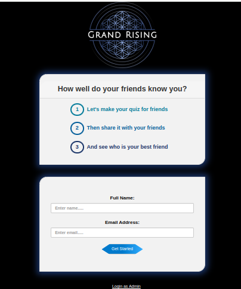
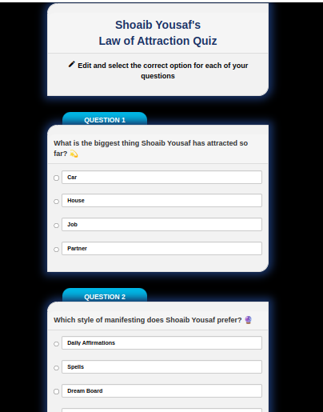
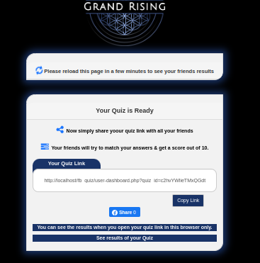
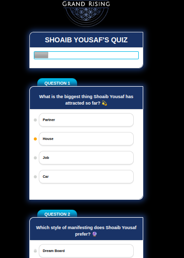
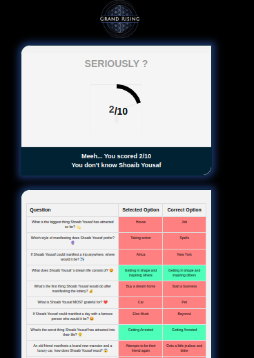

# KnowMeQuiz 🎯

**KnowMeQuiz** is a fun and interactive PHP-based web application where users can create personalized quizzes about themselves and share them with friends. Friends then try to guess the correct answers to see how well they know the quiz creator. It's a great way to engage with your circle and discover who truly knows you best!

---

## ✨ Features

- 👤 Users can create a quiz about themselves
- 🔗 Share the quiz with friends via a custom link
- ✅ Friends can attempt the quiz without signing up
- 📊 Quiz creator can view results and see who knows them best
- 🔐 Admin login panel for backend management

---

## 📸 Screenshots
  
 
 
 
 

---

## 🛠️ Built With

- PHP
- MySQL
- Bootstrap 3
- HTML / CSS / JavaScript

---

## 🚀 How to Run Locally

1. **Clone the repository:**

   ```bash
   git clone https://github.com/your-username/knowmequiz.git
   cd knowmequiz

---
## Import the Database:

Open phpMyAdmin or your MySQL tool.

Create a new database (e.g., knowmequiz).

Import the fbquiz.sql file included in the repository.

Configure the database connection:

In the file config/connection.php, update the following variables with your local setup:

php
Copy
Edit
<?php
$servername = "localhost"; // usually localhost
$username = "root";        // your MySQL username
$password = "";            // your MySQL password
$dbname = "knowmequiz";    // name of your database

$connect = mysqli_connect($servername, $username, $password, $dbname);

if (!$connect) {
    die("Connection failed: " . mysqli_connect_error());
}
?>
Start a local PHP server:

bash
Copy
Edit
php -S localhost:8000
Visit the app in your browser:

http://localhost:8000